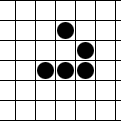

## CAS FEE Project 2: GameOfLife

Das Spiel des Lebens (engl. Conway’s Game of Life) ist ein vom Mathematiker John Horton Conway 1970 entworfenes Spiel, basierend auf einem zweidimensionalen zellulären Automaten. Es ist eine einfache und bis heute populäre  Automaten-Theorie von Stanisław Marcin Ulam.

(Quelle: https://de.wikipedia.org/wiki/Conways_Spiel_des_Lebens)

## Installation und Starten
- Installieren der Angular CLI: `npm install -g @angular/cli`
- Ausführen `git clone https://github.com/ebourbou/GameOfLife.git`
- Das `aws-exports.js` aus dem Installations Mail in `GameOfLife/src` kopieren.
- Ausführen von `npm install`
- Zum Starten `ng serve` und im Browser auf `http://localhost:4200/` navigieren.

## Online
Das Spiel ist online spielbar auf [ebourbou.github.io/GameOfLife](https://ebourbou.github.io/GameOfLife/)
Es handelt sich jedoch um experimentelle, temporäre Installation ohne Anspruch auf Vollständigkeit oder Korrektheit.

## Known bugs / Limitationen
- AWS Verification kein erneutes Senden Verifikations Code 
- Passwort Reset ist nur über die aws console möglich
- Benutzer sind nicht löschbar, auch nur über die aws console 
- Alle serverseitigen Ressourcen (Spiele, Patterns, User) werden immer vollständig geladen.
- Nicht alle Module des Spiels sind responsiv. Wir haben uns auf die Menüeinträge 'Neues Spiel' und 'Meine Spiele' fokussiert.
- Verschiedene Mängel bei der Anwendung von ngrx wegen fehlender Erfahrung und grosser Komplexität. Symptome:
    * Im Spiel werden alle Generationenwechsel innerhalb der Komponente in einem Loop ausgelöst, anstatt dass die vorherige Generation im Effekt die nächste triggert. Funktioniert, aber ist falsch.
    * Spiele lassen sich nicht pausieren oder abbrechen.
    * Sporadische ExpressionChangedAfterItHasBeenChecked-Errors. Wir konnten diese noch nicht genauer eingrenzen.
    * Refresh-Probleme im Pattern-Carousel bei sehr kleinen Viewports.

## Deployment auf GitHub
ng build erzeugt eine Distribution im Verzeichnis ./docs. Durch das pushen auf github wird diese dann auf github.io deployed (wie alles im docs folder):
- Branch gh-pages auschecken
- vom root (dort wo das package.json ist)> ng build --prod --output-path docs --base-href /GameOfLife/
- als Ergebnis hat man die Distribution im Folder docs
- Dort im main.js alle Links zum Verzeichnis 'assets' anpassen. Die Struktur der Sourcen ist hierarchisch. Diese wird beim build zusammengestaucht. Zu sehen im dist-Verzeichnis. Das assets-Verzeichnis ist dann direkt unter dem Root (wo die JS und HTML sind), Links müssen daher alle so aussehen: './assets/img/icon...' 
- einchecken und pushen

Siehe auch
- https://angular.io/guide/deployment
- https://docs.github.com/en/github/working-with-github-pages/configuring-a-publishing-source-for-your-github-pages-site#publishing-your-github-pages-site-from-a-docs-folder-on-your-master-branch
- https://stackoverflow.com/questions/56379595/images-are-not-loading-after-deploying-angular-app-on-github-pages
